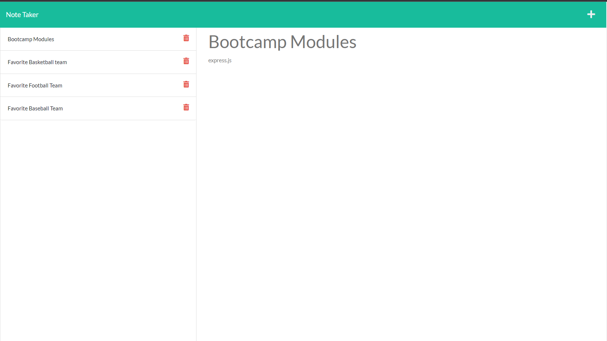

# Week 11 Challenge Note Taker

## Table of Contents:

1. [Description](#description)
2. [Installation](#installation)
3. [Usage](#usage)
4. [License](#license)
5. [Contributing](#contributing)
6. [Test](#tests)
7. [Questions](#questions)

## Description:

create an application that can be used to write and save notes. This application will use an Express.js back end and will save and retrieve note data from a JSON file

## Installation:

npm packages for express and uuid will be needed for this project

## Usage:

User from the front end will add a note to be saved and that note will be saved in a database on the backend using express and also will be created with an unique id

## License:

MIT
[Link to license](https://opensource.org/licenses/MIT)

## Contributing:

Anthony Speece has contributed on this project as of today.

## Tests:

testing has been done by entering text and title on the front end and seeing if they have been save to the database.

## Questions:

GitHub Username: A-Speece
Email: anthonyspeece@gmail.com
Link to the Heroku deployment: https://bootcamp-challenge-note-taker.herokuapp.com/

